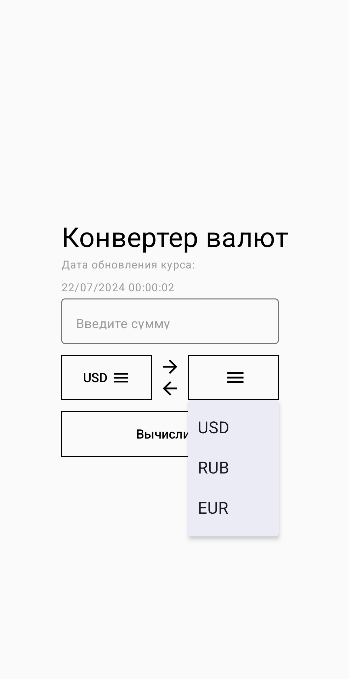
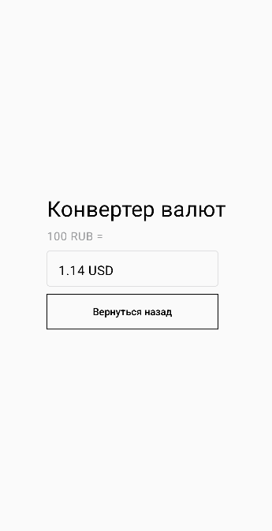

# Exchange Rates
## Technology stack
The source code of the application was written in Kotlin. MVVM was used as an architectural template. Interaction with the network was implemented using Retrofit. Coroutine is used for asynchronous operation. Dagger was used to implement dependency injection. The application uses jetpack compose.
Currency transfer is carried out using the API https://app.exchangerate-api.com/.
## Screenshots

